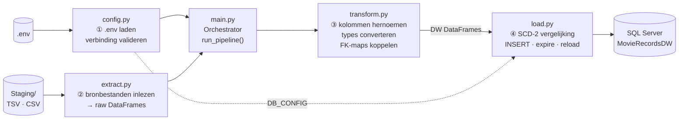
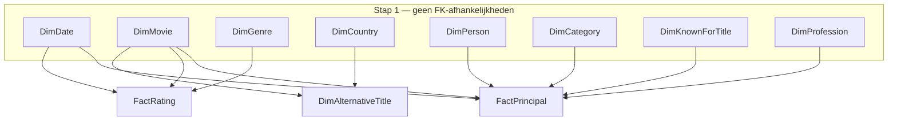

# MovieRecords ETL

Python-implementatie van de **MovieRecords** datawarehouse-pipeline. Laadt IMDb-stagingbestanden in een SQL Server-datawarehouse — dezelfde laadvolgorde en SCD-2-logica als het oorspronkelijke SSIS-pakket (`movierecords_initLoad`).

---

## Overzicht

| Onderdeel | Beschrijving |
|-----------|--------------|
| **Bron** | Lokale staging-bestanden (TSV/CSV) uit IMDb-datasets |
| **Doel** | Schema `dbo` in database `MovieRecordsDW` op SQL Server 2022 |
| **Patroon** | ETL: Extract → Transform → Load |
| **Dimensies** | SCD Type 2 (historiek via `RowStartDate` / `RowEndDate`) |
| **Feiten** | Truncate-and-reload (`FactRating`, `FactPrincipal`) |

---

## Architectuur

### Procesflow

`main.py` orkestreert de volledige pipeline in vier fasen:



### Laadvolgorde (FK-afhankelijkheden)



> Feitentabellen altijd ná alle dimensies laden, anders falen de FK-lookups stilletjes (NULL-waarden) of crashen ze.

---

## Projectstructuur

```
DataAnalist_MovieRecords_python_etl-pipeline/
├── pipeline/               # ETL-kernpakket
│   ├── __init__.py
│   ├── config.py           # .env laden, DB_CONFIG, validate_config()
│   ├── extract.py          # Bronbestanden → raw DataFrames
│   ├── transform.py        # DataFrames → DW-schema (kolommen, types, FK's)
│   └── load.py             # SCD-2, statische dims, feit-tabellen, SK-maps
├── sql/
│   ├── create_tables.sql   # Eenmalig uitvoeren om schema + tabellen aan te maken
│   └── truncate_tables.sql # Alle tabellen leegmaken (optioneel, bij herstart)
├── docker/
│   └── docker-compose.yml  # Optionele SQL Server 2022 container (Developer edition)
├── Staging/                # Bronbestanden (TSV + CSV, gitignored)
├── main.py                 # Entry point / CLI-orchestrator
├── check_db.py             # Verbindings- en schemaverificatie
├── requirements.txt
└── .env                    # Verbindingsinstellingen (gitignored, zelf aanmaken)
```

---

## Bronbestanden en DW-tabellen

Staging-bestanden horen in de map die je instelt via `STAGING_DIR` (standaard `./Staging`):

| Bestand | Alias in code | DW-tabel(len) | Laadtype |
|---------|---------------|---------------|----------|
| `title.basics.tsv` | `title_basics` | DimMovie, DimGenre | SCD-2 |
| `title.ratings.tsv` | `title_ratings` | FactRating | Feit |
| `title.akas.tsv` | `title_akas` | DimAlternativeTitle | SCD-2 |
| `name.basics.tsv` | `name_basics` | DimPerson, DimProfession, DimKnownForTitle | SCD-2 |
| `title.principals.tsv` | `title_principals` | DimCategory, FactPrincipal | SCD-2 / Feit |
| `dimdates.csv` | `dimdates` | DimDate | Statisch |
| `iban.csv` | `iban` | DimCountry | Statisch |

TSV-bestanden gebruiken tab als scheidingsteken; `\N` staat voor NULL. Gecomprimeerde bestanden (`.tsv.gz`) worden automatisch herkend.

---

## Installatie

**Vereisten:** Python 3.11+, ODBC Driver 17 for SQL Server, SQL Server 2022 (lokaal of via Docker)

```powershell
cd C:\<bestandslocatie>
python -m venv .venv
.\.venv\Scripts\Activate.ps1
pip install -r requirements.txt
```

In de IDE: kies als interpreter `.venv\Scripts\python.exe`.

---

## Configuratie

Maak een `.env` in de root van je projectmap. De inhoud hangt af van hoe je verbinding maakt:

### Windows-authenticatie (lokale named instance via Shared Memory)

```env
DB_HOST=lpc:localhost\SYNTRA_TOM
DB_PORT=1433
DB_NAME=MovieRecordsDW
DB_AUTH=windows

STAGING_DIR=./Staging
LOG_LEVEL=INFO
```

> Het `lpc:`-prefix dwingt het Shared Memory-protocol af. Gebruik dit als TCP/IP uitgeschakeld is op de SQL Server-instance. Werkt alleen op de lokale machine.

### SQL Server-authenticatie (Docker of externe server)

```env
DB_HOST=localhost
DB_PORT=1433
DB_NAME=MovieRecordsDW
DB_AUTH=sql
DB_USER=sa
DB_PASSWORD=<jouw-wachtwoord>

STAGING_DIR=./Staging
LOG_LEVEL=INFO
```

### Overzicht variabelen

| Variabele | Verplicht | Standaard | Beschrijving |
|-----------|-----------|-----------|--------------|
| `DB_HOST` | **Ja** | — | Hostnaam, IP of `lpc:localhost\<instance>` voor Shared Memory |
| `DB_AUTH` | Nee | `sql` | `windows` (Windows-auth) of `sql` (gebruikersnaam + wachtwoord) |
| `DB_PASSWORD` | Alleen bij `DB_AUTH=sql` | — | SA- of gebruikerswachtwoord |
| `DB_PORT` | Nee | `1433` | TCP-poort (niet gebruikt bij `lpc:`-verbinding) |
| `DB_NAME` | Nee | `MovieRecordsDW` | Database-naam |
| `DB_USER` | Nee | `sa` | Gebruikersnaam (alleen bij `DB_AUTH=sql`) |
| `STAGING_DIR` | Nee | `./Staging` | Pad naar de staging-bestanden |
| `DB_SCHEMA` | Nee | `dbo` | SQL Server-schema |
| `LOG_LEVEL` | Nee | `INFO` | `DEBUG` · `INFO` · `WARNING` · `ERROR` |

---

## Database opstarten

### Optie A — Lokale SQL Server-instance

Zorg dat de SQL Server-service draait (te controleren via Services of SQL Server Configuration Manager). Als TCP/IP uitgeschakeld is, gebruik dan het `lpc:`-prefix in `DB_HOST` (zie Configuratie hierboven).

Controleer welke protocollen ingeschakeld zijn:

```powershell
# TCP/IP status
Get-ItemProperty "HKLM:\SOFTWARE\Microsoft\Microsoft SQL Server\MSSQL16.<instance>\MSSQLServer\SuperSocketNetLib\Tcp" | Select-Object Enabled

# Shared Memory status
Get-ItemProperty "HKLM:\SOFTWARE\Microsoft\Microsoft SQL Server\MSSQL16.<instance>\MSSQLServer\SuperSocketNetLib\Sm" | Select-Object Enabled
```

### Optie B — Via Docker (SQL Server 2022 Developer)

```powershell
docker compose -f docker/docker-compose.yml up -d
```

Wacht tot de container `healthy` is:

```powershell
docker compose -f docker/docker-compose.yml ps
```

Gebruik voor Docker `DB_AUTH=sql` met het wachtwoord dat je in `.env` instelt als `DB_PASSWORD`.

### Schema aanmaken

Voer `sql/create_tables.sql` eenmalig uit via `sqlcmd`:

```powershell
# Windows-authenticatie (Shared Memory)
sqlcmd -S "lpc:localhost\SYNTRA_TOM" -d MovieRecordsDW -E -I -i sql/create_tables.sql

# SQL Server-authenticatie (TCP, bv. Docker)
sqlcmd -S localhost,1433 -U sa -P <wachtwoord> -d MovieRecordsDW -i sql/create_tables.sql
```

> De `-I` vlag is verplicht voor filtered indexes (`QUOTED_IDENTIFIER ON`).

Controleer daarna de verbinding en het schema:

```powershell
python check_db.py
python check_db.py --table DimMovie
```

---

## Pipeline uitvoeren

```powershell
# Volledige ETL (alle tabellen in FK-veilige volgorde)
python main.py

# Alleen specifieke tabellen
python main.py --tables DimMovie DimGenre
python main.py --tables FactRating
```

---

## Laadstrategie

| Type | Tabellen | Aanpak |
|------|----------|--------|
| **SCD-2** | DimMovie, DimGenre, DimPerson, DimKnownForTitle, DimProfession, DimAlternativeTitle | Historiek via `RowStartDate`/`RowEndDate`; gewijzigde rij afgesloten + nieuwe versie ingevoegd |
| **Statisch** | DimDate, DimCountry | Alleen nieuwe business keys invoegen — geen TRUNCATE, FK's blijven intact |
| **DimCategory** | — | Technisch SCD-2, maar zonder tracked kolommen; gedraagt zich als statische dimensie |
| **Feiten** | FactRating, FactPrincipal | `TRUNCATE` + batch `INSERT`; FactPrincipal in chunks van 50 000 rijen (> 80 M rijen) |

---

## Afhankelijkheden

| Package | Versie | Gebruik |
|---------|--------|---------|
| `pandas` | 3.0.3 | DataFrames en transformaties |
| `numpy` | 2.4.6 | Type-conversies bij het laden (integers, floats, booleans) |
| `pyodbc` | 5.3.0 | SQL Server-verbinding via ODBC Driver 17 |
| `python-dotenv` | 1.2.2 | `.env` laden |

---

## Troubleshooting

| Probleem | Oplossing |
|----------|-----------|
| `Import "pandas" could not be resolved` | Activeer `.venv` en selecteer de juiste Python-interpreter in je editor |
| Verbinding geweigerd (10061) | TCP/IP is uitgeschakeld op de instance; gebruik `lpc:localhost\<instance>` voor Shared Memory, of schakel TCP in via SQL Server Configuration Manager (`C:\Windows\SysWOW64\SQLServerManager16.msc`) |
| SQL Server Browser gestopt | Vereist voor named instances via TCP; niet nodig bij Shared Memory (`lpc:`-prefix) |
| Schema `MovieRecordsDW` bestaat niet | Voer `sql/create_tables.sql` uit met `sqlcmd -I` (zie Schema aanmaken) |
| `QUOTED_IDENTIFIER`-fout bij indexes | Voeg `-I` toe aan het `sqlcmd`-commando |
| Staging-map niet gevonden | Controleer `STAGING_DIR` in `.env`; standaard is `./Staging` (hoofdletter S) |
| FK-fout bij feitentabellen | Dimensies moeten volledig geladen zijn vóór `FactRating`/`FactPrincipal` |
| `KeyError` bij transform | Kolom ontbreekt in kolomselectie `transform.py`; zet `LOG_LEVEL=DEBUG` voor details |
| Feitentabellen leeg na ETL | `LOG_LEVEL=DEBUG` toont FK-lookup statistieken en het aantal NULL-waarden per kolom |
| Rijen met `NULL`-FKs | De corresponderende dimensierij ontbreekt of is niet actief (`RowEndDate IS NULL`) |
