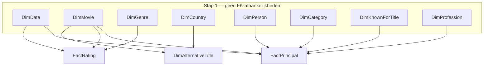

# MovieRecords ETL

Python-implementatie van de **MovieRecords** datawarehouse-pipeline. Dit project laadt IMDb-stagingbestanden in een PostgreSQL-datawarehouse, met dezelfde laadvolgorde en SCD-2-logica als het oorspronkelijke SSIS-pakket (`movierecords_initLoad`).

---

## Overzicht

| Onderdeel | Beschrijving |
|-----------|--------------|
| **Bron** | Lokale staging-bestanden (TSV/CSV) uit IMDb-datasets |
| **Doel** | Schema `MovieRecordsDW` op PostgreSQL |
| **Patroon** | ETL: Extract → Transform → Load |
| **Dimensies** | SCD Type 2 (historiek via `RowStartDate` / `RowEndDate`) |
| **Feiten** | Truncate-and-reload (`FactRating`, `FactPrincipal`) |

---

## Architectuur

### Bronbestanden → DW-tabellen

```
staging/                    extract.py          transform.py          load.py
─────────                   ──────────          ────────────          ───────
title.basics.tsv      ──►   pandas          ──►  DW-kolommen    ──►  PostgreSQL
title.ratings.tsv           DataFrames          + FK-lookup          MovieRecordsDW.*
title.akas.tsv
name.basics.tsv
title.principals.tsv
dimdates.csv
iban.csv
```

---

### Procesflow

`main.py` orkestreert de volledige pipeline in vier fasen. Elke pijl toont hoe data of configuratie van het ene module naar het andere stroomt.


---

### Laadvolgorde (FK-afhankelijkheden)

Dimensies zonder FK's worden als eerste geladen. Daarna worden afhankelijke tabellen geladen in de volgorde die de pijlen aangeven.



> Feitentabellen altijd ná alle dimensies laden, anders falen de FK-lookups stilletjes (NULL-waarden) of crashen ze.

---

## Projectstructuur

```
movieRecords/
├── pipeline/               # ETL-kernpakket (Python-package)
│   ├── __init__.py
│   ├── config.py
│   ├── extract.py
│   ├── transform.py
│   └── load.py
├── sql/
│   ├── create_tables.sql
│   └── truncate_tables.sql
├── docker/
│   ├── docker-compose.yml
│   ├── pg_hba.conf
│   └── postgresql.conf
├── staging/                # Bronbestanden (TSV + CSV, gitignored)
├── main.py
├── check_db.py
├── requirements.txt
├── .env                    # Credentials (niet committen)
└── README.md
```

---

## Bestandsreferentie

### `main.py` — Entry point / CLI-orchestrator

| Sectie | Functie | Beschrijving |
|--------|---------|--------------|
| Pipeline stappen | `run_dim_date` | Transform + laad DimDate (statisch, geen SCD-2) |
| | `run_dim_movie` | Transform + laad DimMovie via SCD-2 |
| | `run_dim_genre` | Transform + laad DimGenre via SCD-2 |
| | `run_dim_country` | Transform + laad DimCountry (statisch, geen SCD-2) |
| | `run_dim_person` | Transform + laad DimPerson via SCD-2 |
| | `run_dim_category` | Transform + laad DimCategory via SCD-2 (geen tracked cols) |
| | `run_dim_known_for_title` | Transform + laad DimKnownForTitle via SCD-2 |
| | `run_dim_profession` | Transform + laad DimProfession via SCD-2 |
| | `run_dim_alternative_title` | Bouwt movie- en country-SK-maps op, laad DimAlternativeTitle |
| | `run_fact_rating` | Bouwt alle benodigde SK-maps op, laad FactRating via truncate-insert |
| | `run_fact_principal` | Bouwt 6 SK-maps op (incl. composite voor DimCategory), laad FactPrincipal |
| Pipeline orchestrator | `run_pipeline` | Voert extract_all uit, doorloopt tabellen in FK-veilige volgorde |
| CLI | `parse_args` | Verwerkt het `--tables`-argument voor selectieve uitvoering |

---

### `pipeline/config.py` — Omgevingsvariabelen en databaseconfiguratie

| Sectie | Naam | Beschrijving |
|--------|------|--------------|
| Database configuratie | `DB_CONFIG` | Dict met psycopg2-verbindingsparameters (host, port, dbname, user, password) |
| Database schema | `DB_SCHEMA` | Doelschema-naam (standaard: `MovieRecordsDW`) |
| Bestandspaden | `STAGING_DIR` | Pad naar de map met staging-bestanden |
| | `validate_config()` | Controleert of `DB_HOST` en `DB_PASSWORD` in `.env` aanwezig zijn; gooit `EnvironmentError` als ze ontbreken |

---

### `pipeline/extract.py` — Inlezen staging-bestanden

| Sectie | Functie | Beschrijving |
|--------|---------|--------------|
| Lezers | `read_tsv(filepath)` | Leest een IMDb TSV-bestand; converteert `\N` naar `NaN`, alle kolommen als string; ondersteunt `.tsv.gz` |
| | `read_csv(filepath)` | Leest een CSV-bestand met standaard pandas-instellingen |
| Hoofd extract-functie | `extract_all(staging_dir)` | Leest alle 7 bronbestanden in één keer; geeft `dict[alias → DataFrame]` terug; gooit `FileNotFoundError` bij ontbrekende bestanden |

---

### `pipeline/transform.py` — Mapping bron-DataFrames naar DW-schema

| Sectie | Functie | Beschrijving |
|--------|---------|--------------|
| Hulpfuncties | `_split_column(series, sep, n)` | Splitst een gescheiden Series in exact `n` kolommen; vult ontbrekende posities met `NaN` |
| | `_scd2_defaults(df, now)` | Voegt `RowStartDate = now` en `RowEndDate = NULL` toe voor SCD-2-dimensies |
| Dimensies | `transform_dim_date(dimdates_df)` | Filtert op 1 januari per jaar als jaarankerdatum; hernoemt CSV-kolommen naar DW-namen |
| | `transform_dim_movie(title_basics, now)` | Selecteert tconst + 4 attributen; converteert `isAdult` van `'0'/'1'` naar boolean |
| | `transform_dim_genre(title_basics, now)` | Splitst de kommalijst in `genres` op in maximaal 3 afzonderlijke genrekolommen |
| | `transform_dim_person(name_basics, now)` | Selecteert nconst en primaryName |
| | `transform_dim_profession(name_basics, now)` | Splitst `primaryProfession` op in maximaal 3 beroepskolommen |
| | `transform_dim_known_for_title(name_basics, now)` | Splitst `knownForTitles` op in maximaal 4 tconst-kolommen; één rij per persoon (business key: nconst) |
| | `transform_dim_category(title_principals, now)` | Dedupliceert alle unieke `(category, job)`-combinaties |
| | `transform_dim_country(iban_df)` | Hernoemt ISO 3166-1 kolommen; geen SCD-2 |
| | `transform_dim_alternative_title(title_akas, movie_sk_map, country_sk_map, now)` | Koppelt movie- en country-FK's; converteert `isOriginalTitle`; sluit rijen zonder movie-FK of titel uit |
| Feiten | `transform_fact_rating(title_basics, title_ratings, ...)` | Inner join van basics + ratings op tconst; koppelt 4 dimensie-SKs |
| | `transform_fact_principal(title_principals, name_basics, ...)` | Left join met name_basics voor geboortejaar/sterfjaar; koppelt 7 dimensie-SKs; enkel movie + person zijn verplicht |

---

### `pipeline/load.py` — SCD-2 en feit-tabel laadlogica

| Sectie | Functie | Beschrijving |
|--------|---------|--------------|
| Verbinding | `get_connection(db_config)` | Maakt een nieuwe psycopg2-verbinding aan |
| Hulpfuncties (intern) | `_quoted(name)` | Omhult een kolomnaam met dubbele aanhalingstekens voor PostgreSQL |
| | `_to_python_value(value)` | Converteert numpy/pandas-types naar native Python voor psycopg2 |
| | `_fetch_active(cur, table, columns)` | Haalt alle actieve rijen op (`RowEndDate IS NULL`) als DataFrame |
| | `_bulk_insert(cur, table, columns, df)` | Voegt rijen in via `execute_values` (batch); geeft aantal ingevoegde rijen terug |
| | `_expire_rows(cur, table, sk_col, sk_values, now)` | Sluit verouderde rijen af door `RowEndDate = now` te zetten |
| | `_fetch_existing_keys(cur, table, business_keys)` | Haalt bestaande business keys op als `set` voor dubbele-rij-detectie |
| Generieke SCD-2 loader | `load_scd2(conn, table, sk_col, business_keys, tracked_cols, source_df, now)` | Voert volledige SCD-2-cyclus uit: detecteert nieuwe / gewijzigde / ongewijzigde rijen en past de tabel aan |
| Statische dimensies | `load_dimension_static(conn, table, columns, business_keys, source_df, ...)` | Voegt enkel nieuwe business keys in (geen TRUNCATE); `force_reload=True` doet TRUNCATE CASCADE |
| Feit-tabellen | `load_fact_truncate_insert(conn, table, columns, source_df, chunk_size)` | TRUNCATE + batch INSERT in chunks van standaard 50.000 rijen |
| SK-lookup opbouwen | `fetch_sk_map(conn, table, sk_col, key_col, scd2)` | Bouwt `{key → SK}`-dict op voor enkelvoudige FK-oplossing; `scd2=False` voor statische dimensies |
| | `fetch_sk_map_composite(conn, table, sk_col, key_cols)` | Bouwt `{(key1, key2) → SK}`-dict op voor samengestelde sleutels (bv. DimCategory) |

---

### `check_db.py` — Verbindings- en schemaverificatie

| Sectie | Functie | Beschrijving |
|--------|---------|--------------|
| Verbinding | `connect()` | Verbindt met PostgreSQL via `pipeline/config`; zet autocommit aan |
| Metadata ophalen | `fetch_schemas(cur)` | Haalt alle gebruikersschema's op (filtert systeem-schema's weg) |
| | `fetch_tables(cur, schema)` | Haalt alle tabellen op binnen een schema |
| | `fetch_columns(cur, schema, table)` | Haalt kolomdefinities op (naam, type, nullable, default) |
| | `fetch_primary_keys(cur, schema, table)` | Haalt de PK-kolom(men) op van een tabel |
| | `fetch_foreign_keys(cur, schema, table)` | Haalt FK-relaties op als `{kolom → referentie}`-dict |
| | `_format_type(...)` | Zet ruwe PostgreSQL UDT-namen om naar leesbare labels (bv. `int4` → `INTEGER`) |
| Terminal-uitvoer | `print_header(title)` | Print een opgemaakte sectiekop (72 tekens breed) |
| | `print_connection_info(conn, schema)` | Toont host, poort, database, gebruiker en PostgreSQL-versie |
| | `print_schemas(cur, target_schema)` | Toont beschikbare schema's; waarschuwt als doelschema ontbreekt |
| | `print_tables(cur, schema)` | Toont genummerde lijst van alle tabellen in het schema |
| | `print_table_details(cur, schema, table)` | Toont per kolom: type, NULL/NOT NULL, PK en FK-referentie |
| Uitvoering | `run(table_filter)` | Voert de volledige verificatie uit; geeft exitcode 0 (OK) of 1 (fout) terug |
| CLI | `parse_args()` | Verwerkt het optionele `--table`-argument |

---

## Datawarehouse-tabellen

| Tabel | Type | Bron |
|-------|------|------|
| DimDate | Dimensie (statisch) | `dimdates.csv` |
| DimMovie | Dimensie (SCD-2) | `title.basics.tsv` |
| DimGenre | Dimensie (SCD-2) | `title.basics.tsv` |
| DimCountry | Dimensie (statisch) | `iban.csv` |
| DimPerson | Dimensie (SCD-2) | `name.basics.tsv` |
| DimCategory | Dimensie (SCD-2) | `title.principals.tsv` |
| DimKnownForTitle | Dimensie (SCD-2) | `name.basics.tsv` |
| DimProfession | Dimensie (SCD-2) | `name.basics.tsv` |
| DimAlternativeTitle | Dimensie (SCD-2) | `title.akas.tsv` |
| FactRating | Feit | `title.basics.tsv` + `title.ratings.tsv` |
| FactPrincipal | Feit | `title.principals.tsv` + `name.basics.tsv` |

---

## Staging-bestanden

Plaats deze bestanden in de map die je instelt via `STAGING_DIR` (standaard `./Staging`):

| Bestand | Alias in code |
|---------|---------------|
| `title.basics.tsv` | `title_basics` |
| `title.ratings.tsv` | `title_ratings` |
| `title.akas.tsv` | `title_akas` |
| `name.basics.tsv` | `name_basics` |
| `title.principals.tsv` | `title_principals` |
| `dimdates.csv` | `dimdates` |
| `iban.csv` | `iban` |

TSV-bestanden gebruiken tab als scheidingsteken; ontbrekende waarden staan als `\N`. Gecomprimeerde bestanden (`.tsv.gz`) worden automatisch herkend.

---

## Vereisten

- Python 3.11+
- PostgreSQL-database (lokaal via Docker of extern)
- Staging-bestanden (lokaal of gekopieerd vanuit SSIS: `movierecords_initLoad/Staging`)

---

## Installatie

```powershell
cd c:\School\python\movieRecords

# Virtuele omgeving
python -m venv .venv
.\.venv\Scripts\Activate.ps1

# Dependencies
pip install -r requirements.txt
```

In Cursor/VS Code: kies als interpreter `.venv\Scripts\python.exe` (zie `.vscode/settings.json`).

---

## Configuratie

Maak een `.env` in de projectmap:

```env
DB_HOST=localhost
DB_PORT=5432
DB_NAME=postgres
DB_USER=postgres
DB_PASSWORD=<jouw-wachtwoord>

STAGING_DIR=./Staging
DB_SCHEMA=MovieRecordsDW
LOG_LEVEL=INFO
```

| Variabele | Verplicht | Standaard | Beschrijving |
|-----------|-----------|-----------|--------------|
| `DB_HOST` | Ja | — | Hostnaam of IP van de PostgreSQL-server |
| `DB_PASSWORD` | Ja | — | Database-wachtwoord |
| `DB_PORT` | Nee | `5432` | Poort (gebruik `6543` voor pgBouncer/Supabase pooler) |
| `DB_NAME` | Nee | `postgres` | Naam van de PostgreSQL-database |
| `DB_USER` | Nee | `postgres` | Database-gebruiker |
| `STAGING_DIR` | Nee | `./Staging` | Pad naar de map met staging-bestanden |
| `DB_SCHEMA` | Nee | `MovieRecordsDW` | PostgreSQL-schema voor de DW-tabellen |
| `LOG_LEVEL` | Nee | `INFO` | Logniveau: `DEBUG`, `INFO`, `WARNING`, `ERROR` |

> Commit `.env` nooit naar git (staat in `.gitignore`).

---

## Database aanmaken

Voer `sql/create_tables.sql` eenmalig uit op je PostgreSQL-server. Afhankelijk van je omgeving:

- **Docker**: verbind via `psql`, pgAdmin of een andere SQL-client en voer het script uit.
- **Supabase**: plak de inhoud in de SQL Editor (Dashboard → SQL Editor).

Controleer daarna de verbinding en het schema:

```powershell
python check_db.py
python check_db.py --table DimMovie
```

---

## Pipeline uitvoeren

Volledige ETL (alle tabellen in de juiste volgorde):

```powershell
python main.py
```

Alleen specifieke tabellen:

```powershell
python main.py --tables DimMovie DimGenre
python main.py --tables FactRating
```

> `--skip-download` wordt geaccepteerd als vlag maar heeft geen effect: bronbestanden worden altijd uit de lokale staging-map gelezen.

---

## Laadstrategie

- **SCD-2 dimensies** (DimMovie, DimGenre, DimPerson, DimKnownForTitle, DimProfession, DimAlternativeTitle): historiek via `RowStartDate` / `RowEndDate`. Bij een gewijzigde tracked-kolom wordt de oude rij afgesloten en een nieuwe versie ingevoegd.
- **Statische dimensies** (DimDate, DimCountry): alleen nieuwe business keys worden ingevoegd — geen TRUNCATE, zodat FK's in feit-tabellen intact blijven. Geen SCD-2-kolommen.
- **DimCategory**: technisch SCD-2, maar zonder tracked kolommen. Werkt in de praktijk als statische dimensie: enkel nieuwe `(category, job)`-combinaties worden ingevoegd.
- **Feitentabellen** (FactRating, FactPrincipal): `TRUNCATE` + batch `INSERT` — volledige herlading per run. FactPrincipal wordt in chunks van 50.000 rijen geladen vanwege de omvang (> 80 M rijen).

---

## Afhankelijkheden

| Package | Versie | Gebruik |
|---------|--------|---------|
| `pandas` | 3.0.3 | DataFrames, transformaties |
| `psycopg2-binary` | 2.9.12 | PostgreSQL-verbinding |
| `python-dotenv` | 1.2.2 | `.env` laden |
| `pycountry` | 26.2.16 | Landmetadata voor DimCountry |
| `requests` | 2.34.2 | Legacy — momenteel niet in gebruik |
| `tqdm` | 4.67.3 | Legacy — momenteel niet in gebruik |

---

## Troubleshooting

| Probleem | Oplossing |
|----------|-----------|
| `Import "pandas" could not be resolved` | Activeer `.venv` en selecteer de juiste Python-interpreter |
| `Staging-map niet gevonden` | Controleer `STAGING_DIR` in `.env`; standaard is `./Staging` (hoofdletter S) |
| `Schema 'MovieRecordsDW' bestaat niet` | Voer `create_tables.sql` uit op de database |
| Verbinding mislukt | Controleer `DB_HOST` en `DB_PASSWORD`; test met `db_connection_test.py` |
| FK-fout bij feitentabellen | Dimensies moeten volledig geladen zijn vóór `FactRating` / `FactPrincipal` |
| `KeyError: [...] not in index` | Een transform geeft een kolom niet terug die als business key of tracked col is ingesteld; controleer de kolomselectie in `transform.py` |
| Feitentabellen leeg na ETL | Zet `LOG_LEVEL=DEBUG` in `.env` voor gedetailleerde FK-lookup statistieken |
| Rijen zonder FK (`NULL`-waarden) | De corresponderende dimensierij ontbreekt of is niet actief (`RowEndDate IS NULL`) |

---
